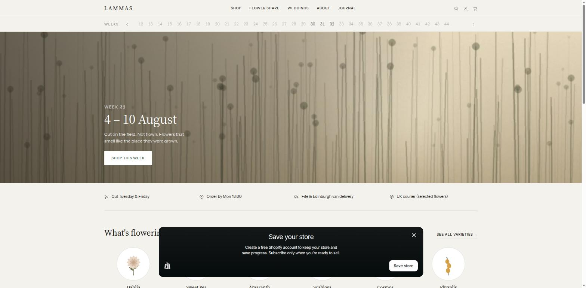
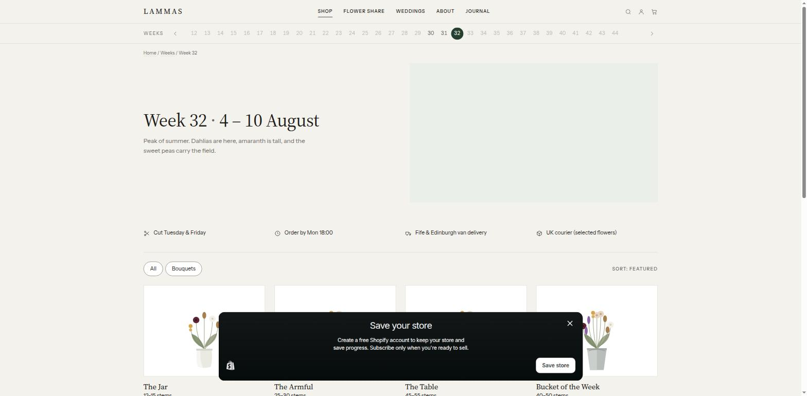
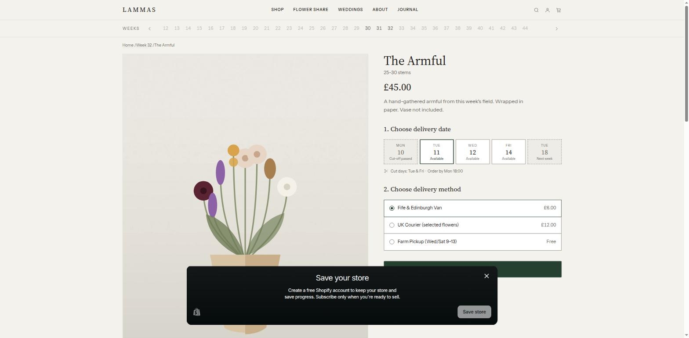

# LAMMAS — a Shopify OS 2.0 theme for a cut-flower farm

Four acres in the Howe of Fife, one field, two polytunnels. Nothing is flown,
nothing is treated to hold longer than it naturally would, and there is nothing
to sell between November and March.

That last fact is the design brief. This is a shop where **the season is the
product**: what you can buy depends on which week it is, what came off the field
that week, and whether those particular flowers survive a courier.



## What is interesting in here

**A vocabulary Shopify does not have.** A variety is a thing, a week is a thing,
and a bouquet is a recipe applied to a week. All three are metaobjects —
`variety`, `week`, `delivery_day`, `delivery_method` — and `shop.metafields.lammas.current_week`
is the single switch the whole storefront turns on. The home page's cut list and
a bouquet's composition read the same records, so they cannot disagree.



**A date picker that is a function of the clock.** A tile is closed because its
cut-off has passed, not because stock ran out, and it says which. Each
`delivery_day` carries its cut-off as unix seconds, and the state — open, closed,
next week — is worked out in Liquid at render time. Nothing to regenerate, nothing
to go stale.

**A delivery rule that cannot drift.** Dahlias bruise and sweet peas last two
days, so they never go in a parcel. Choose UK Courier on a bouquet built from
them and the page names the flowers standing in the way — from the same cut list
that the cart re-checks before it will let the order through.



**An honest closed sign.** Out of season the hero says so and offers the two
things the farm can still take: a place on next year's list, and the archive.

**Drawn, not photographed.** Every bouquet on the site is an inline SVG built
from the varieties actually in it this week; `tools/make-plates.py` paints the
seven field plates.

## Structure

```
sections/         hero, week page, product, cart, journal, content pages
snippets/         bouquet + variety drawings, cart line, cart problems, facets
templates/        JSON templates; collection.json is a *week*
assets/           theme.css, generated field plates
tools/
  make-plates.py     paints the photography
  deploy-store.mjs   builds the season in a real store
preview/          a local Liquid harness with the whole season — `npm run preview`
```

## Running it

```bash
npm install
npm run preview          # http://localhost:4000
```

Against a real store:

```bash
node tools/deploy-store.mjs <store>.myshopify.com
shopify theme push --store <store>.myshopify.com
```

Steps: `definitions`, `varieties`, `weeks`, `delivery`, `products`,
`collections`, `pages`, `journal`, `publish`. Re-run `products` when the week
turns — a bouquet's composition is that week's cut list, and it is the one fact
the store cannot work out for itself.

## Known limits

The cart states every problem and disables its own checkout button, but a theme
cannot stop Shopify's checkout — that needs a cart-validation Shopify Function.
Delivery prices are shown from the `delivery_method` metaobjects; the amount
actually charged comes from the store's shipping settings.

`shopify theme check` passes with no errors.
